# Laporan Proyek: Prediksi Kualitas Udara (PM2.5) Bandar Lampung

## 1. Pendahuluan

### 1.1. Latar Belakang Masalah
Kualitas udara yang buruk, terutama tingginya kadar partikulat halus (PM2.5), merupakan ancaman serius bagi kesehatan masyarakat di kawasan perkotaan. Peningkatan aktivitas industri, volume kendaraan bermotor, dan perubahan cuaca dapat memengaruhi fluktuasi polusi udara secara signifikan. Oleh karena itu, diperlukan sebuah sistem cerdas yang mampu memprediksi kualitas udara di masa depan agar masyarakat dan pemangku kebijakan dapat mengambil tindakan preventif yang tepat.

### 1.2. Business Understanding
Dalam konteks *Smart City*, pemantauan lingkungan merupakan salah satu pilar utama. Proyek ini bertujuan untuk memberikan solusi berbasis data dengan membangun sistem prediksi polusi udara (PM2.5). Sistem ini akan memberikan wawasan (insight) prediktif kepada masyarakat terkait tingkat bahaya polusi di lokasi dan waktu tertentu, sehingga dapat membantu meminimalisir risiko paparan polusi terhadap warga kota.

### 1.3. Tujuan Proyek
- Membangun model *Machine Learning* yang dapat memprediksi tingkat konsentrasi PM2.5 berdasarkan parameter cuaca dan waktu.
- Melakukan evaluasi dan eksperimentasi model menggunakan *tools tracking* seperti MLflow.
- Mengembangkan dan men-deploy *dashboard* interaktif berbasis web (Flask) agar prediksi model dapat diakses dengan mudah oleh pengguna akhir.

## 2. Deskripsi Dataset
Dataset yang digunakan berisi rekam data polusi dan cuaca lokal yang disimpan dalam file `data_polusi_lokal.csv`. Data ini bersumber dari API publik seperti OpenAQ / Open-Meteo. 
**Fitur (Features) yang digunakan meliputi:**
- `hour`: Jam pengukuran (0-23).
- `day_of_week`: Hari dalam seminggu.
- `latitude` & `longitude`: Koordinat geografis lokasi pemantauan.
- `temperature`: Suhu udara.
- `humidity`: Kelembapan udara.
- `wind_speed`: Kecepatan angin.

**Target:**
- `pm25`: Tingkat konsentrasi partikulat PM2.5 (mikrogram per meter kubik).

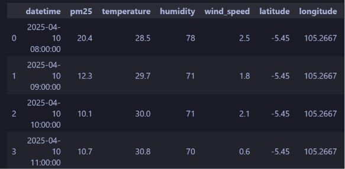
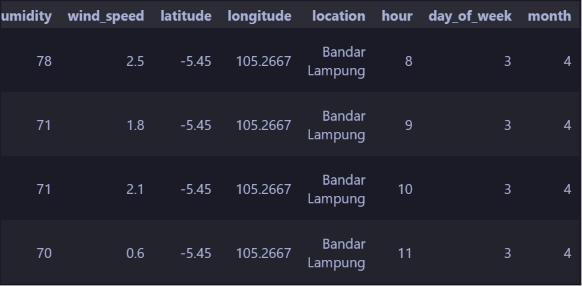
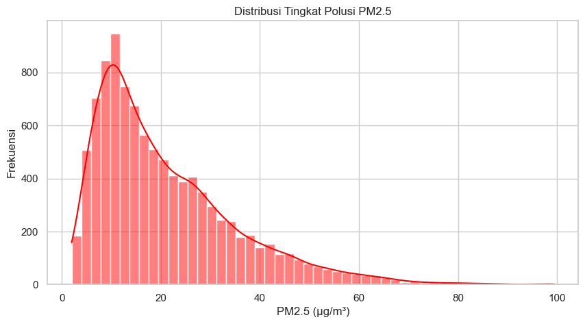

## 3. Metodologi (Data Science Process)

### 3.1. Data Preparation dan Cleaning
Proses ini mencakup pengumpulan data mentah, pembersihan nilai yang kosong (*missing values*), penyesuaian format tipe data, serta ekstraksi fitur waktu seperti `hour` dan `day_of_week` dari data *timestamp*. Hal ini bertujuan agar data bebas dari anomali dan formatnya kompatibel saat diproses oleh algoritma *Machine Learning*.

### 3.2. Exploratory Data Analysis (EDA)
Tahap EDA dilakukan untuk mengeksplorasi karakteristik data. Pada tahap ini, dianalisis distribusi fitur serta korelasi antara variabel cuaca (suhu, kelembapan, kecepatan angin) terhadap tingkat PM2.5. Selain itu, divisualisasikan pula pola fluktuasi polusi berdasarkan parameter waktu.

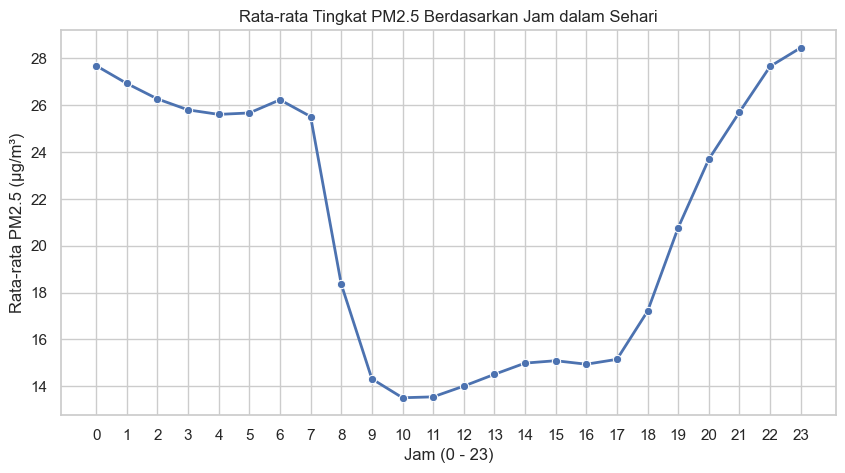

### 3.3. Modeling
Proses pemodelan menggunakan algoritma **HistGradientBoostingRegressor** dari library *Scikit-Learn*, yang cepat dan efisien dalam menangani data tabular dengan banyak observasi.
- **Hyperparameter Tuning:** Menggunakan `RandomizedSearchCV` yang digabungkan dengan validasi silang (*Cross-Validation*) untuk menemukan konfigurasi parameter terbaik (seperti `learning_rate`, `max_iter`, `max_depth`).
- **Experiment Tracking:** Menggunakan **MLflow** (yang terhubung dengan DagsHub) untuk mencatat (*log*) secara sistematis parameter, metrik evaluasi, dan model dari setiap perulangan eksperimen.

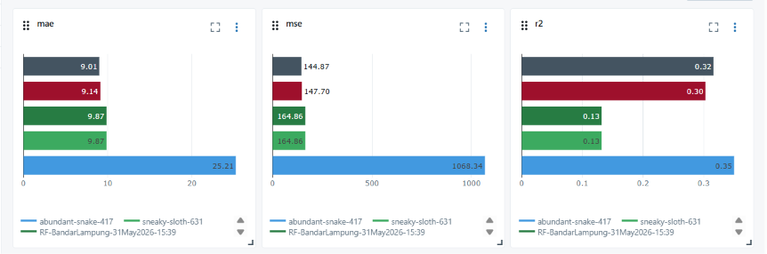

### 3.4. Evaluasi
Model terbaik hasil *tuning* dievaluasi pada data pengujian (*Test Set*) untuk melihat kinerjanya menggunakan beberapa metrik regresi, yaitu:
- **Mean Absolute Error (MAE):** Rata-rata selisih absolut antara nilai prediksi dan nilai sebenarnya.
- **Mean Squared Error (MSE):** Rata-rata dari kuadrat selisih nilai prediksi dan aktual.
- **R-Squared ($R^2$):** Proporsi varians dari variabel target yang dapat dijelaskan oleh fitur-fitur independen yang digunakan.

## 4. Dashboard dan Form Prediksi
Model *Machine Learning* yang siap digunakan telah disimpan dalam format file `.joblib` dan diintegrasikan ke dalam backend menggunakan *framework* **Flask**. Aplikasi web ini menyediakan *endpoint* API dan halaman antarmuka HTML. Melalui sebuah *form* interaktif di halaman utama (*Dashboard*), pengguna dapat memasukkan variabel kondisi lingkungan (suhu, kelembapan, jam, dll.), dan sistem secara *real-time* akan memberikan skor prediksi PM2.5 beserta keterangan tingkat berbahayanya.

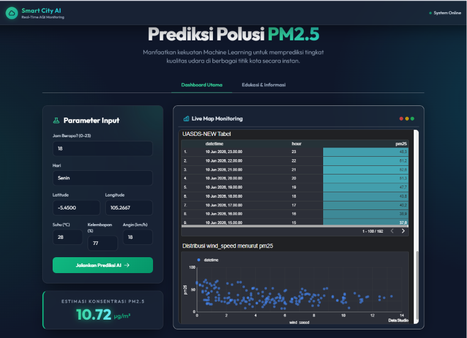

Seperti pada gambar, kita dapat memasukkan jam, hari, latitude, longtitude, suhu,
kelembapan, dan angin. Kemudian, prediksi akan langsung menujukkan estimasi
konsentrasi pm2.5 sebagai penanda apakah kualitas udara sedang baik atau tidak.

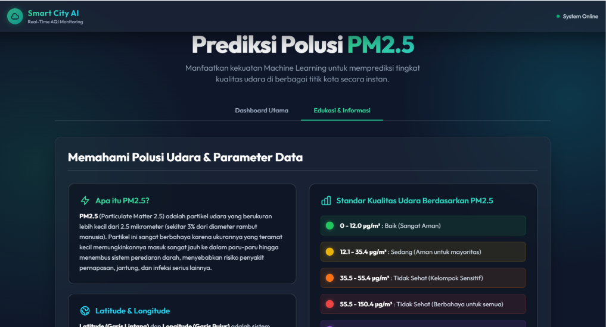

Kemudian, di dalamnya juga terdapat halaman edukasi dan informasi yang berisikan
beberapa pengetahuan seperti kondisi udara menurut pm2.5 itu seperti apa.

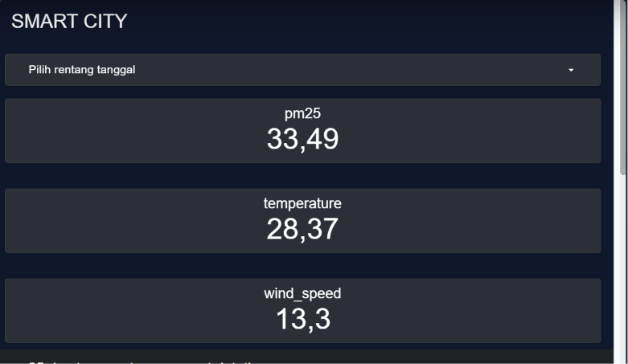

Di bagian dashboard nya, saya menggunaka google looker yang di embed ke website
saya, di bagian pertama, saya menampilkan rata-rata pm2.5, kemudian rata-rata
temperature, dan rata-rata wind_speed. 

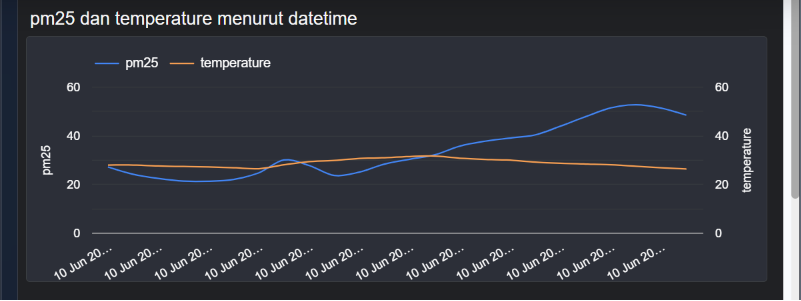

Kemudian, di dashboard ini juga ditampilkan grafik garis yang menunjukkan perubahan
yang terjadi pada pm2.5 dan temperature setiap jamnya, apakah menaik atau menurun

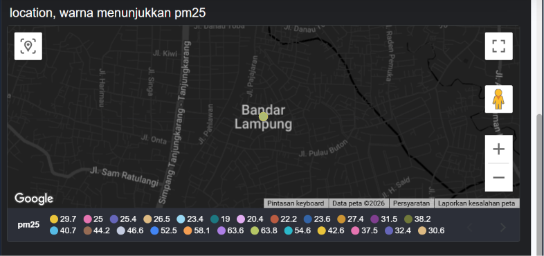

Kemudian, ada juga peta balon yang menunjukkan kondisi pm2.5 pada Bandar Lampung
sesuai dengan warna yang muncul.

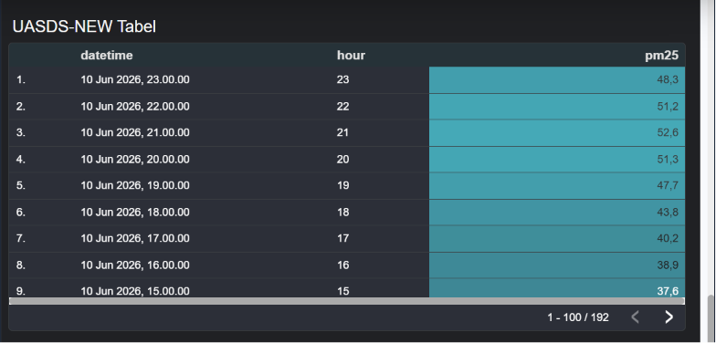

Kemudian, ada juga tabel heatmap yang menampilkan pm2.5 per jam di tiap hari mulai
dari hari pada saat website di akses. Jadi, akan selalu update. Hal ini juga berlaku dengan
grafik dan box score yang lain

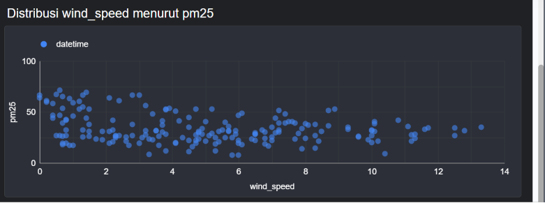

Kemudian yang terakhir, ada distribusi wind_speed menurut pm2.5 yang ditampilkan
dalam bentuk grafik scatter plot. 

## 5. Kesimpulan dan Saran

### 5.1. Kesimpulan
- Model berbasis *HistGradientBoostingRegressor* dengan *Hyperparameter Tuning* mampu memberikan hasil prediksi kadar PM2.5 yang memadai berdasarkan parameter lokasi, waktu, dan elemen cuaca.
- Penggunaan alat pelacakan seperti MLflow terbukti esensial dalam menjaga proses pelatihan model terstruktur dan metrik pengujian mudah untuk dikomparasi.
- *Dashboard* berbasis web mempermudah akses fungsionalitas model oleh pengguna akhir, sehingga penerapan *Smart City* dalam pemantauan lingkungan udara dapat disimulasikan secara komprehensif.

### 5.2. Saran
- **Kuantitas dan Kualitas Data:** Untuk pengembangan selanjutnya, disarankan memperkaya dataset dari rentang waktu multi-tahun serta mengakomodasi data polusi jenis lain seperti SO2, NO2, atau CO.
- **Penggunaan Model Lanjutan:** Mengingat polusi erat kaitannya dengan deret waktu (*time-series*), pendekatan model prediktif berbasis *Deep Learning* seperti Long Short-Term Memory (LSTM) patut dieksplorasi di masa depan.
- **Pengembangan UI/UX:** Dashboard dapat dikembangkan lebih lanjut dengan pemetaan spasial (peta interaktif) untuk melihat perbedaan kondisi kualitas udara antar wilayah secara langsung.
